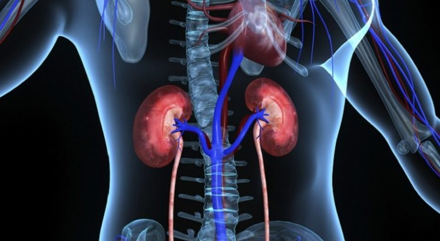

<h1 align="center">Hi there! 🚀 
  
   I'm Jalal Ud Din Babar😄
</h1>

  

### About me

- 👨‍💻 Lecturer at AJ Science College   
- ✍️ I write a newsletter called [*Machine learning by hand*](https://www.linkedin.com/in/jalal-ud-din-babar-726389210/)  
- 📹 YouTube Channel [*JalaluddinBabar*](https://youtu.be/m7WpJduQ9BY)
- 🌱 Learning: Advanced Statistics, Bayesian Modeling, and MLOps
- 🔧 Technologies I work with: C++, Python, AWS and more
- ⚡ Fun fact: I love exploring new tech and solving challenging problems!

---
### Languages and Tools

 
   
   
   
   

  
  
   
   
   
   
  
  
  
  

 

---

## 📊 GitHub Stats

  
  

---

### 🚀 My Projects

- [Web Development Projects](https://jalaludin17.github.io/Calculator/) - Deployed web development projects
- [Machine Learning Projects](https://github.com/Jalaludin17?tab=repositories&q=machine+learning)   [1](https://jalaludin17.github.io/chd-prediction/) - Projects including models and algorithms in ML.
- [Machine learning Applications]() - Projects including full deployment of ml applications
- [Deep Learning Projects](https://github.com/Jalaludin17?tab=repositories&q=deep+learning) - Neural networks and DL implementations.
- [Generative AI Projects](https://github.com/Jalaludin17?tab=repositories&q=genai) - Projects related to generative AI and AI art.

---
<table>
  <tr>
    <td style="background: #fff; border-radius: 16px; padding: 15px; width: 320px; vertical-align: top; box-shadow: 0 1px 4px #ccc;">
      
      <h3>Heart Disease Prediction System</h3>
      
This Heart Disease Prediction System uses advanced machine learning to assess health data and estimate heart disease risk instantly. Empower timely health decisions with accurate, AI-driven predictions.

      <a href="https://jalaludin17.github.io/chd-prediction/">test it</a>
    </td>
    <td style="width: 20px;"></td> <!-- spacer column -->
    <td style="background: #fff; border-radius: 16px; padding: 15px; width: 320px; vertical-align: top; box-shadow: 0 1px 4px #ccc;">
      
      <h3>Coronary Kidney Detection Prediction</h3>
      
This Coronary Kidney Detection Prediction project implements a comprehensive machine learning solution, inspired by research, to predict cardiovascular risks in chronic kidney disease patients.

      <a href="https://your-link-here.com">test it</a>
    </td>
  </tr>
</table>

---

⭐ _“Turning data into insights, and insights into action.”_

